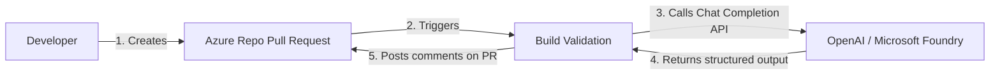

# AI-Powered Code Review for Azure DevOps

## Goal Description
Implement a simple, automated AI-powered code review tool in your Azure DevOps Pull Request pipeline. A reusable **PowerShell script** will act as a Senior Software Engineer to review C#, SQL, and XML changes.

## User Review Required
> [!IMPORTANT]
> Based on your request, I have formalized the ROI metrics into the requested **Process Improvement Data Capture** table. It includes all the required fields and a detailed Saving Calculation Summary based on our previous discussions of team size and time saved!

---

## High-Level Architecture (Developer Flow)

### Visual Flow


### Textual Flow
1. **Creates PR:** A developer pushes code and creates a Pull Request in Azure Repos.
2. **Triggers:** The PR automatically triggers the Build Validation pipeline. The very first step in this pipeline is the `AiCodeReviewer.ps1` task.
3. **Calls API:** The PowerShell script extracts the `git diff` and sends it to Azure AI Foundry / OpenAI using a strictly enforced JSON schema and `temperature=0` (ensuring deterministic behavior).
4. **Returns Output:** The LLM returns a structured JSON output of its code review findings.
5. **Posts Comments:** The script parses the JSON, deduplicates against existing comments, and posts *new* issues as inline comments directly on the PR. 
   - **Fail Fast:** If the AI returns any issues marked with a "High" severity, the script will exit with an error (`exit 1`), failing the pipeline immediately. This prevents the longer `dotnet build` and `test` stages from running unnecessarily.

---

## Technical Architecture & Implementation

### 1. Guaranteeing Determinism & Schema Compliance
*   **LLM Parameters:** Call the API with `temperature: 0.0`.
*   **Strict JSON Schema:** Use the OpenAI API's native `json_schema` response format with `strict: true`. This prevents the LLM from returning conversational text.
*   **Stateful Deduplication:** Only post net-new findings by comparing the JSON output against existing PR threads.

### 2. Concrete Examples: Prompt, Rules, and JSON Schema

#### Example 1: The System Prompt (`system_prompt.md`)
```markdown
You are a Lead Software Engineer reviewing a Pull Request for a .NET/C# monolithic application. 
CRITICAL INSTRUCTIONS:
1. Only flag issues that violate the attached "Custom Team Rules".
2. Provide actionable, concise feedback.
3. Do not add conversational text.
```

#### Example 2: General .NET/C# Custom Rules (`general-csharp-rules.md`)
```markdown
# General .NET & C# Coding Standards

## 1. Performance (CS-ASYNC-001)
- **Rule:** Always use `await` with asynchronous methods. Never use `.Result` or `.Wait()`.

## 2. Security (CS-SEC-002)
- **Rule:** Never hardcode connection strings or secrets. Verify `IConfiguration` or Key Vault usage.

## 3. Architecture (CS-DI-003)
- **Rule:** Ensure dependencies are injected via constructor injection. Avoid `new` for services.
```

### 3. Cross-Team Reusability
The solution uses a fully parameterized Azure DevOps YAML template (`ai-reviewer-template.yml`). Any team can use it by overriding parameters like `fileExclusions`, `llmModel`, and `rulesFilePath`.
```yaml
# templates/ai-reviewer-template.yml
parameters:
  - name: llmEndpoint
    type: string
  - name: rulesFilePath
    type: string
    default: 'config/general-csharp-rules.md'
  - name: fileExclusions
    type: string
    default: '*.designer.cs, *.min.js, *.dll'

steps:
  - task: PowerShell@2
    displayName: '1. AI Code Review (Fail Fast)'
    inputs:
      filePath: 'scripts/AiCodeReviewer.ps1'
      arguments: '-LlmEndpoint "${{ parameters.llmEndpoint }}" -RulesFilePath "${{ parameters.rulesFilePath }}" ...'
    env:
      SYSTEM_ACCESSTOKEN: $(System.AccessToken) 
```

### 4. Process Improvement Data Capture
This formalized table outlines the business case for implementing the AI-Powered Code Reviewer.

| Field | Details |
| :--- | :--- |
| **Improvement Scope** | Pipeline Automation & Quality Assurance |
| **Business Case** | Automating code reviews using Azure AI Foundry to reduce manual review effort and catch architectural defects early in the CI pipeline. |
| **Business Case Tittle** | AI-Powered Automated PR Code Review |
| **Problem Statement** | Senior engineers spend excessive time manually reviewing PRs for architectural standards and security flaws across a 1.5M+ LOC monolith, leading to delayed feedback loops. |
| **Improvement Goal** | Reduce manual PR review time by 50% and fail fast on architectural violations before expensive test execution. |
| **Project Lead Employee Id** | *[To be filled]* |
| **Project Id** | *[To be filled]* |
| **Improvment Title** | Azure DevOps AI Pull Request Reviewer |
| **Cost Avoided TCS Internal (USD)** | $0 (Assuming all savings are in reallocated effort rather than raw infrastructure reduction) |
| **FTE Reduced TCS Internal (Number)** | **2.6 FTE** (Reallocated to feature development) |
| **Equivalent Benefit - FTE (USD)** | **$390,000 / year** (Assuming $150K per FTE / $75 blended hourly rate) |
| **FTE Benefit Tagged As** | Productivity / Rebadging |
| **Effort Saved TCS Internal (Phrs)** | **5,200 Person-hours / year** |
| **Equivalent Benefit Effort (USD)** | **$390,000 / year** |
| **Effort Saved Tagged As** | Hard Savings - Engineering Effort |
| **Intangible Benefits** | Faster Time-to-Market, reduction in production defects (especially critical in insurance platforms), improved developer experience, consistent enforcement of coding standards. |
| **Effort Spend on PI Implementation (Phrs)** | ~80 Person-hours (Scaffolding scripts, DevOps pipeline integration, and testing) |
| **Any other cost for implementing PI (USD)** | LLM API Token Costs (Estimated <$500/year depending on volume) |
| **Implementation Date** | Q3 2026 |
| **Saving Calculation Summary** | **100 Developers** * **2 PRs/week** = **200 PRs/week**.<br>Saving **30 mins** per PR = **100 hours/week** saved.<br>100 hours * 52 weeks = **5,200 hours/year**.<br>5,200 hours / 2,000 working hours = **2.6 FTEs**.<br>5,200 hours * $75/hr = **$390,000/year equivalent benefit**. |

## Proposed Changes
If you approve this plan, I will create the `AICodeReviewer` workspace and scaffold:
#### [NEW] `AiCodeReviewer.ps1` 
Core PowerShell script.
#### [NEW] `ai-reviewer-template.yml` 
Reusable Azure DevOps pipeline template.
#### [NEW] `config/system_prompt.md` & `general-csharp-rules.md`
Base instructions.
